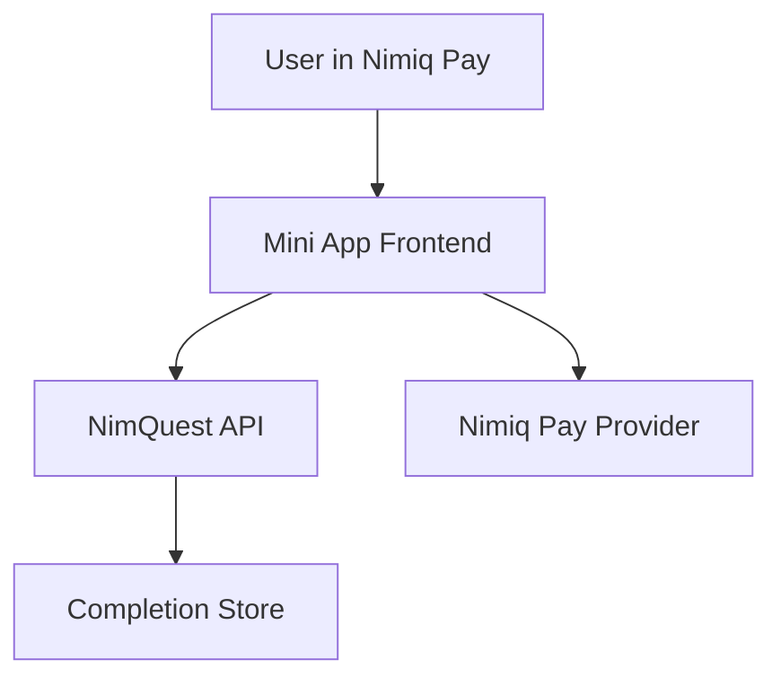

# NimQuest Architecture

## System Shape

NimQuest is built as a small web app with a backend API first and frontend last.



## Backend

Current backend stack:

- Node.js native HTTP server.
- Dependency-free API for speed and low risk.
- JSON completion store.
- Node test runner.

Backend responsibilities:

- Serve public quest data.
- Keep answer keys server-side.
- Grade submitted answers.
- Validate wallet address and device identifier inputs.
- Store completion proofs.
- Block duplicate reward eligibility per quest and wallet.
- Prepare NIM claim intents for frontend wallet execution.

Routes:

```txt
GET  /health
GET  /api/quests
GET  /api/quests/:id
POST /api/complete
POST /api/claim-intents
```

## Frontend

Frontend comes after backend stability.

Planned frontend responsibilities:

- Mobile-first quest flow.
- Nimiq Pay provider detection.
- Wallet account access.
- Device identifier request if available.
- Quiz submission.
- Completion proof display.
- Browser fallback for judges testing outside Nimiq Pay.

## Trust Boundaries

| Boundary | Rule |
|---|---|
| Frontend to backend | Frontend cannot grade itself. |
| Backend to store | Backend owns completion state. |
| Frontend to wallet | Sensitive actions require Nimiq Pay approval. |
| Repo to secrets | No private keys or secrets in source control. |

## Data Model

Quest:

- `id`
- `title`
- `lesson`
- `rewardNim`
- `estimatedSeconds`
- `questions`

Completion proof:

- `key`
- `questId`
- `walletAddress`
- `deviceId`
- `rewardNim`
- `completedAt`
- `status`

Claim intent:

- `type`
- `asset`
- `amount`
- `recipient`
- `questId`
- `proofKey`
- `memo`
- `status`

## Current Limitations

- Completion store is file-based.
- Real NIM transfer is not integrated yet.
- Claim intents prepare metadata but do not execute transfers yet.
- Wallet proof currently depends on submitted wallet address until Nimiq Pay frontend integration is added.
- No frontend yet.

## Deployment Notes

- API can run with `npm start`.
- Tests run with `npm test`.
- `NIMQUEST_COMPLETION_STORE` can override the JSON completion file path.
