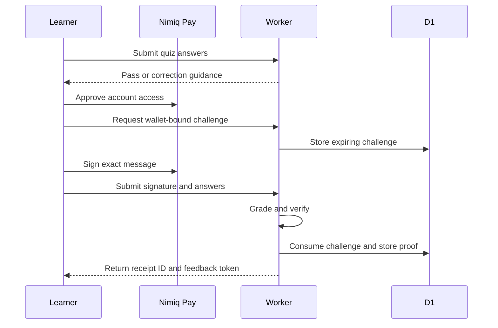

# NimQuest Architecture

## Components

| Component | Function |
| --- | --- |
| Vite frontend | Renders lessons, quizzes, Journey, receipts, badges, legal pages, and leaderboard |
| Nimiq Pay provider | Supplies approved account access, consensus state, block height, and message signing |
| Cloudflare Worker | Serves APIs, grades quizzes, verifies signatures, applies abuse controls, and serves static assets |
| Cloudflare D1 | Stores challenges, completions, feedback, and short-lived rate counters |
| Node server | Provides a compatible local runtime and API test target |

## Data Flow

## Trust Boundaries

| Boundary | Rule |
| --- | --- |
| Browser to Worker | The browser cannot grade itself or create verified proof. |
| Worker to wallet claim | A wallet address alone does not prove control. |
| Frontend to Nimiq Pay | Account access and signing require native user approval. |
| Worker to D1 | Only a valid signature and passed quiz create a completion. |
| Public API | Wallet labels are masked and receipt IDs are opaque. |
| Feedback write | A receipt ID requires its completion-only feedback token. |

## Stored Data

Completion records contain:

- Internal proof key
- Opaque public receipt ID
- Quest ID
- Full wallet address
- Public key
- Verification method
- Completion time
- Verification status
- Reward status
- Hashed feedback token

NimQuest does not request a Nimiq Pay device identifier. Migration `0003` replaces legacy device values with a removal marker.

## Public Data

Public responses can contain:

- Opaque receipt ID
- Quest ID and title
- Masked wallet label
- Verification method
- Completion date
- Verified quest count
- Rank
- Reward status

Public responses do not contain the full wallet address, public key, signature, quiz answers, feedback token, or device identifier.

## Abuse Controls

- Same-origin checks protect browser write requests.
- Grade requests allow 30 requests per minute per source digest.
- Challenge requests allow 10 requests per five minutes per source digest.
- Completion requests allow 20 requests per five minutes per source digest.
- Feedback requests allow 10 requests per five minutes per source digest.
- One wallet can hold at most five active challenges.
- Expired challenges and old rate counters are deleted.

The Worker derives source digests with SHA-256. D1 does not store the raw source IP.

## Database Migrations

| Migration | Purpose |
| --- | --- |
| `0001_initial.sql` | Challenges and verified completions |
| `0002_completion_feedback.sql` | Completion feedback |
| `0003_privacy_and_abuse_controls.sql` | Opaque receipts, feedback authorization, legacy device removal, and rate counters |

## Release Boundary

GitHub CI runs tests, dependency audit, frontend build, browser smoke tests, and Worker dry run. Cloudflare deployment must use a release that has passed these checks. Production D1 migrations remain an explicit deployment step.
