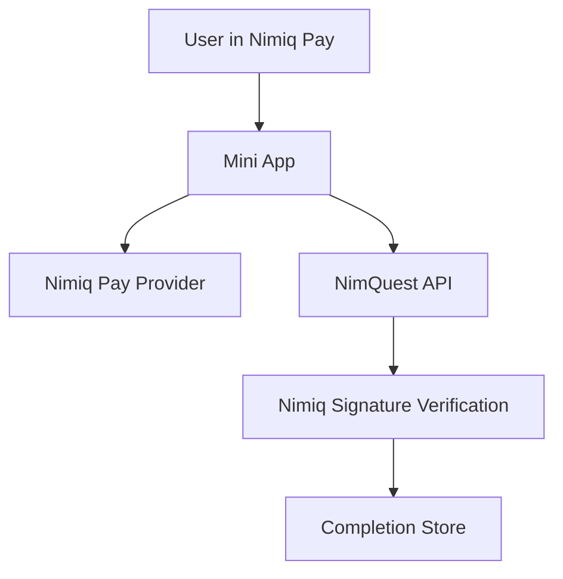

# NimQuest Architecture

## System



## Backend

- Native Node.js HTTP API.
- Official `@nimiq/core` cryptography.
- Atomic JSON completion storage for the MVP.
- Node test runner.

Responsibilities:

- Serve sourced public quest content without answer keys.
- Grade quiz submissions on the server.
- Issue five-minute, wallet-bound signing challenges.
- Derive a Nimiq address from the submitted public key.
- Verify the signature over the exact challenge.
- Consume each nonce once and reject expired or replayed challenges.
- Persist only verified completion proofs.

Routes:

```txt
GET  /health
GET  /api/quests
GET  /api/quests/:id
POST /api/completion-challenges
POST /api/complete
```

## Trust Boundaries

| Boundary | Rule |
|---|---|
| Frontend to backend | The frontend cannot grade itself or create proof. |
| Backend to wallet proof | An address string alone never proves control. |
| Frontend to provider | Account access and signing require user approval. |
| Backend to store | Only signature-verified completion is persisted. |
| Repository to secrets | No private keys or API secrets enter source control. |

## Completion Proof

- `key`
- `questId`
- `walletAddress`
- `deviceId`
- `publicKey`
- `verificationMethod`
- `completedAt`
- `status`
- `reward`

## Current Limits

- Nimiq Pay runtime behaviour still needs testing inside the real Mini App environment.
- Rewards are unavailable until a funded, server-owned payout rail exists.
- Challenges are stored in process memory and expire after five minutes.
- Completion persistence is file-based and suitable for the MVP.
- No frontend has been built.
