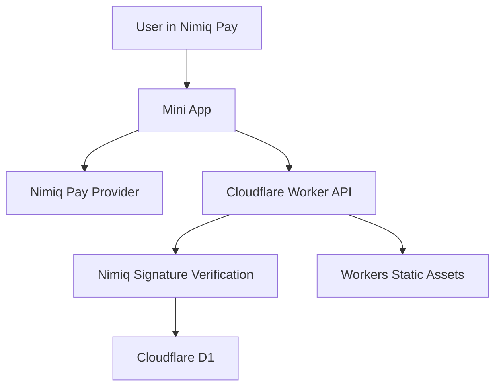

# NimQuest Architecture

## System



## Backend

- Cloudflare Worker production API with Workers Static Assets.
- Cloudflare D1 for challenges and verified completions.
- Web Crypto Ed25519 verification with Nimiq Blake2b address derivation.
- Native Node.js HTTP API and JSON store retained for local compatibility.
- Node tests plus a local `workerd` integration flow.

Responsibilities:

- Serve sourced public quest content without answer keys.
- Grade quiz submissions on the server.
- Issue five-minute, wallet-bound signing challenges.
- Derive a Nimiq address from the submitted public key.
- Verify the signature over the exact challenge.
- Consume each nonce once and reject expired or replayed challenges.
- Persist only verified completion proofs.

Routes:

```txt
GET  /health
GET  /api/quests
GET  /api/quests/:id
POST /api/grade
POST /api/completion-challenges
POST /api/complete
```

## Trust Boundaries

| Boundary | Rule |
|---|---|
| Frontend to backend | The frontend cannot grade itself or create proof. |
| Backend to wallet proof | An address string alone never proves control. |
| Frontend to provider | Account access and signing require user approval. |
| Worker to D1 | Only signature-verified completion is persisted. |
| Repository to secrets | No private keys or API secrets enter source control. |

## Completion Proof

- `key`
- `questId`
- `walletAddress`
- `deviceId`
- `publicKey`
- `verificationMethod`
- `completedAt`
- `status`
- `reward`

## Current Limits

- The built provider flow has passed an injected-provider browser test and the full API flow has passed inside the Workers runtime with a real generated Nimiq signature. Native Nimiq Pay approval still needs one public HTTPS device test.
- Rewards are unavailable until a funded, server-owned payout rail exists.
- Production challenges and completions are persisted in D1. The local Node fallback still uses process memory and a JSON completion file.
- D1 enforces one completion per quest and wallet. Challenge consumption and completion insertion run in one atomic batch.
- The frontend includes landing, Quest Trail, Quest Session, Wallet Proof, and My Journey routes.
- My Journey currently reads the backend-verified proof cached on the current device. Authenticated backend recovery is still pending.
- Quiz feedback happens before wallet access, and the backend grades again before storing completion.
- Workers Static Assets serve the Vite build with SPA fallback. `/api/*` and `/health` always run through the Worker.
