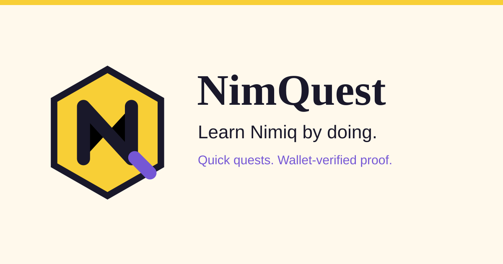
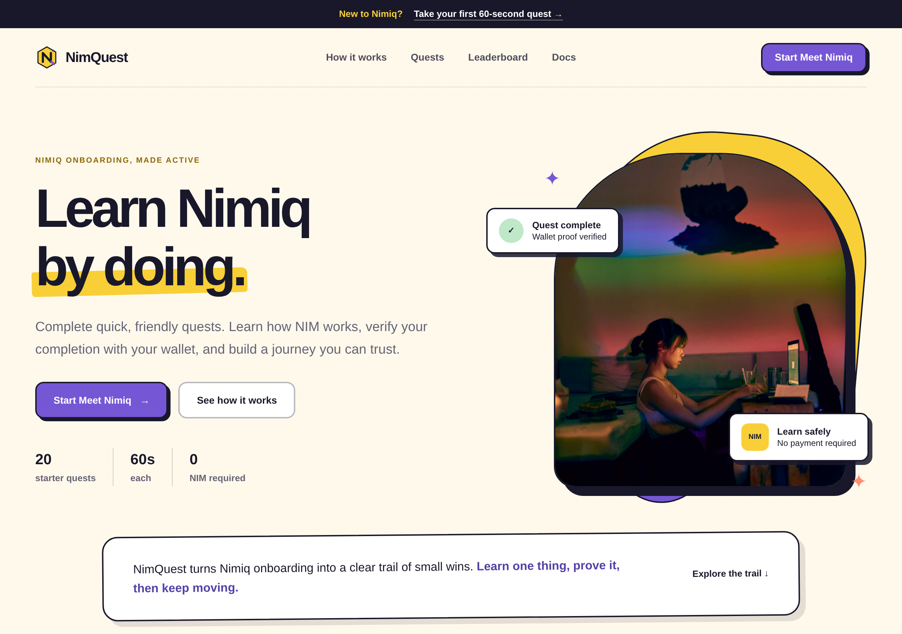
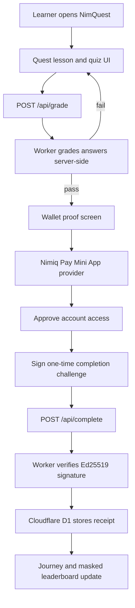
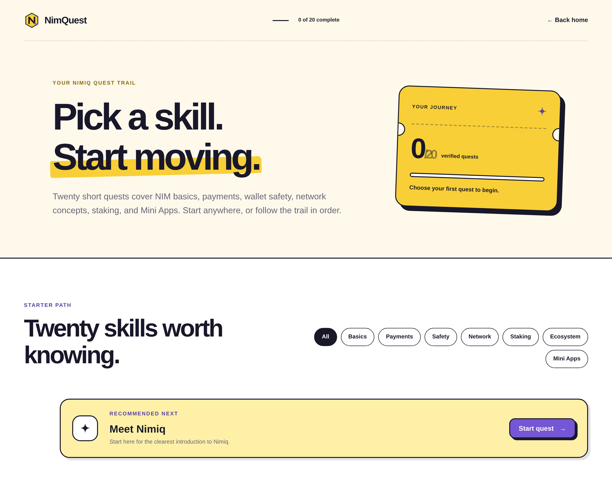
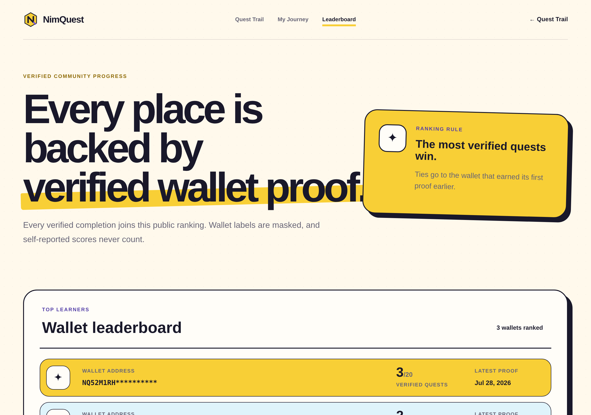
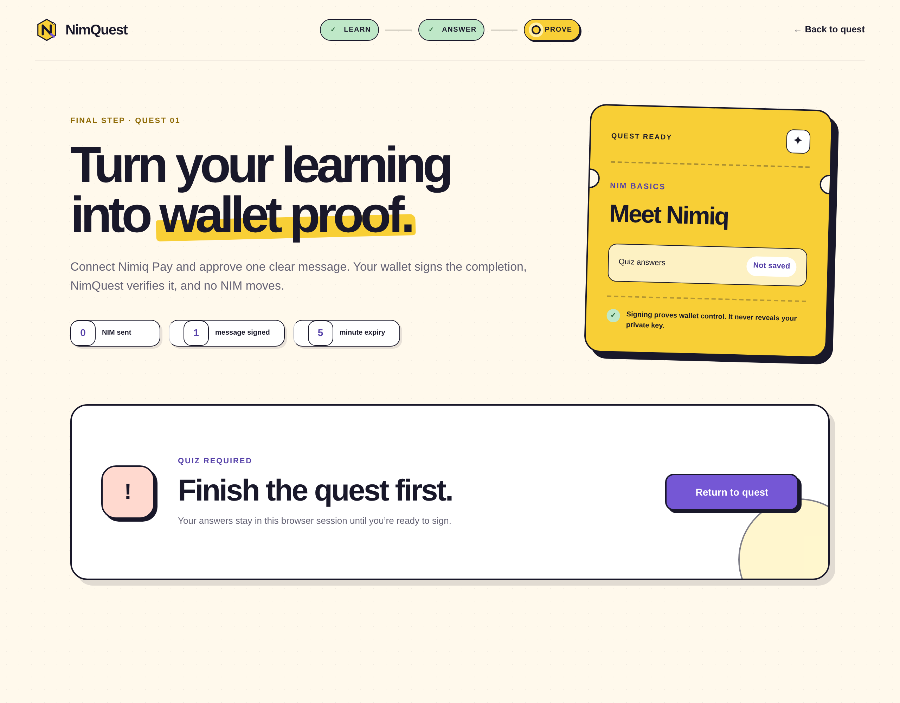
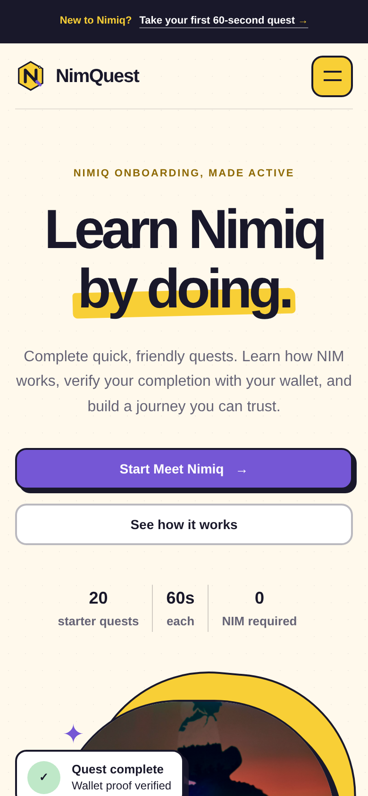

# NimQuest

Learn Nimiq by doing, then prove you learned it with your own wallet.

[](https://github.com/mystiquemide/nimquest/actions/workflows/ci.yml)

[Open the live Mini App](https://nimquest.artistic-chip.workers.dev) · [Watch the product walkthrough](https://youtu.be/iSwB3MyyLZM) · [Launch post](https://x.com/mystiquemide/status/2082365421659820280?s=46) · [In-app docs](https://nimquest.artistic-chip.workers.dev/docs) · [Leaderboard](https://nimquest.artistic-chip.workers.dev/leaderboard)

## Product walkthrough

[](https://youtu.be/iSwB3MyyLZM)

Launch post: [MystiqueMide on X](https://x.com/mystiquemide/status/2082365421659820280?s=46).



## The story

Every time I onboard to a new chain, the "learning" is read-only. I skim a docs page, nod, and close the tab with nothing to show I understood any of it. Quizzes that live in the browser are worse, the answers ship in the page and you can cheat in five seconds.

So I built the opposite. You pass a quiz that is graded on the server, then you sign a one-time message with the wallet you actually control. The receipt is the proof. The real receipt so far: one Meet Nimiq completion signed inside Nimiq Pay on an iPhone, stored in D1, visible on the live leaderboard.

## One-liner

I did not build a token faucet, an airdrop farm, or a browser quiz you can cheat by reading the source. I built a learn-and-prove Mini App where the only thing that counts as "done" is a signature from your wallet, and correct answers never leave the server.

## How it works

You start a quest freely and read a short sourced lesson. The quiz is graded server-side, so the answer key is never in the browser bundle. Only after you pass do you reach the wallet step. You sign a one-time, wallet-bound, expiring message in Nimiq Pay, the Worker verifies the signature and derives the signer address, and the completion is stored in Cloudflare D1. Signing with your NIM wallet through Nimiq Pay is what proves control.

| Operation | Result |
|---|---|
| Start a quest and read the lesson | Immediate |
| Submit quiz answers | Graded server-side, answer key stays hidden |
| Reach the wallet step | Only after the quiz passes |
| Request a signing challenge | Wallet-bound, five-minute expiry, single-use |
| Sign the completion message | Signature verified, address derived from your NIM wallet |
| Duplicate the same quest | Returns the existing proof, no double record |
| Verified completion | Joins the mandatory masked-wallet leaderboard |

## Why Nimiq Pay matters

Nimiq Pay turns NimQuest from a quiz into wallet-backed proof of learning. NimQuest teaches and grades; Nimiq Pay lets the learner prove control of the wallet that claims the completion. The integration runs on the NIM wallet: NimQuest reads the learner's NIM account through the Nimiq Pay Mini App provider and drives that wallet to sign every completion.

After a learner passes the server-graded quiz, NimQuest opens the Nimiq Pay Mini App provider, confirms that consensus is established, asks the learner to approve account access, and then requests one signed message. That message is bound to the quest, wallet, nonce, issue time, and five-minute expiry.

Nimiq Pay keeps the private keys, recovery data, and approval UX. NimQuest receives only what it needs to verify the proof: the selected public account, public key, signature, and signed message result. Signing proves control of the NIM wallet.

```text
Learn quest
  ↓
Server grades answers
  ↓
Nimiq Pay approves account access
  ↓
Worker creates one-time challenge
  ↓
Nimiq Pay signs the challenge
  ↓
Worker verifies Ed25519 signature
  ↓
D1 stores verified completion
  ↓
Masked wallet appears on leaderboard
```

## Architecture



## Integrations

| Integration | How NimQuest uses it |
|---|---|
| Nimiq Pay Mini Apps SDK (`@nimiq/mini-app-sdk`) | Provides the native wallet context. NimQuest initializes the provider, checks consensus, reads the selected public account, and requests the learner’s signature only after the quiz passes. |
| Nimiq Pay signing UX | Shows the learner the exact completion message before approval. The signature proves control of the NIM wallet without exposing private keys. |
| Nimiq core (`@nimiq/core`) | Verifies the Ed25519 signature and derives the signer address from the public key |
| Cloudflare Workers with Static Assets | Serves the app and the API, with quiz grading and signature checks running at the edge |
| Cloudflare D1 | Stores verified completions, one-time challenges, feedback, and rate counters |

Full wallet flow in the live [integration docs](https://nimquest.artistic-chip.workers.dev/docs/integration).

## Product screens

Quest trail with learning paths and the recommended starter quest:



Verified wallet leaderboard, masked labels, ranked by verified quest count:



Wallet proof step, the quiz gate is enforced before signing:



Mobile layout:



## Try it in 2 minutes

Native path (full proof):

1. Open [nimquest.artistic-chip.workers.dev](https://nimquest.artistic-chip.workers.dev) inside Nimiq Pay.
2. Start Meet Nimiq, read the lesson, answer the three questions.
3. Select Verify with Nimiq Pay, approve account access, sign the one-time message.
4. Open My Journey and Leaderboard. The quest shows verified, the count goes up, your masked wallet joins the board.

No-wallet path (verify the server logic without signing):

```bash
# Correct answers pass and unlock the wallet step
curl -s -X POST https://nimquest.artistic-chip.workers.dev/api/grade \
  -H "content-type: application/json" \
  -d '{"questId":"meet-nimiq","answers":[0,0,0]}'

# Read the live verified leaderboard
curl -s https://nimquest.artistic-chip.workers.dev/api/leaderboard
```

The grade response returns per-question correctness and explanations but never the correct index. The quest catalog at `/api/quests` ships lessons and options with no answer keys.

## Ways I tried to break it

Every row maps to a real automated test in the repo.

| Attempt | Outcome | Proof |
|---|---|---|
| Read answer keys from the browser bundle | Not present, catalog is split at build time | `quest-service.test.js`: grades answers before wallet proof without exposing answer indexes |
| Replay an already-used signing challenge | Rejected | `quest-service.test.js`: blocks replay of an already consumed challenge |
| Use an expired challenge | Rejected | `quest-service.test.js`: blocks expired challenges |
| Sign a different message than the challenge | Rejected | `wallet-proof-worker.test.js`: rejects an altered message |
| Sign with a different wallet | Rejected | `quest-service.test.js`: rejects a signature created by a different wallet |
| Skip the quiz and jump to the wallet step | Blocked, grading runs before wallet access | `server.test.js`: grades a quiz before wallet access is requested |
| Complete the same quest twice | Returns the existing proof, no duplicate | `quest-service.test.js`: returns the existing verified proof for a duplicate quest completion |
| Write from a cross-origin browser | Rejected | `server.test.js`: rejects cross-origin browser writes |
| Submit an EVM address instead of a Nimiq one | Rejected | `quest-service.test.js`: accepts generated Nimiq addresses and rejects EVM addresses |

Run them all: `npm test` (25 tests).

## Live proof

- App: https://nimquest.artistic-chip.workers.dev (Cloudflare Workers with Static Assets)
- Health: https://nimquest.artistic-chip.workers.dev/health
- Public quests API: https://nimquest.artistic-chip.workers.dev/api/quests (20 quests, no answer keys)
- Live leaderboard API: https://nimquest.artistic-chip.workers.dev/api/leaderboard
- Storage: Cloudflare D1, three applied migrations in `migrations/`
- Deploys automatically from `main`.
- No smart contract. Completions are wallet-signed records in D1, not on-chain writes.

Do not trust the screenshots. The leaderboard is not seeded, verify the real signed completions yourself:

```bash
curl -s https://nimquest.artistic-chip.workers.dev/api/leaderboard
```

## Real usage

The leaderboard is live D1 data, not seeded mock rows. At the time of writing it shows four distinct masked wallets, with the leader at four verified quests and the earliest proof timestamped 2026-07-28. The first Meet Nimiq proof was signed natively inside Nimiq Pay on an iPhone. Query it yourself with the leaderboard curl above.

## Benchmarks

How NimQuest compares to the obvious alternatives, capability by capability.

| Capability | NimQuest | Docs or blog tutorial | Browser quiz app | Airdrop / faucet quest farm | On-chain proof-of-learning |
|---|:---:|:---:|:---:|:---:|:---:|
| Records that you actually learned | Yes | No | Partial | No | Yes |
| Answers hidden from the browser | Yes | n/a | No | n/a | Varies |
| Proves wallet control | Yes | No | No | Partial | Yes |
| No gas or fees to complete | Yes | Yes | Yes | No | No |
| Resistant to payout sybil farming | Yes | Yes | Yes | No | Varies |
| Runs natively in Nimiq Pay | Yes | No | No | Varies | Varies |
| Verifiable public receipt | Yes | No | No | Partial | Yes |

The pattern: a docs page teaches but proves nothing, a browser quiz proves something you can cheat, an airdrop farm pays for clicks and invites sybils, and an on-chain contract proves control but charges gas for every completion. NimQuest keeps the proof and drops the gas, the cheating surface, and the payout farm.

## Honest limitations

- The code is unaudited.
- Completions are wallet-signed records in Cloudflare D1, not on-chain writes.
- Completion is a signed NIM-wallet operation through Nimiq Pay, not a token transfer, so no NIM leaves your wallet.
- Public leaderboard participation is mandatory after verification.
- Nimiq Pay signing needs the Nimiq Pay Mini App provider.

## Roadmap

What is next for NimQuest, in priority order.

### Short-term

- **Source answer hardening.** Vary the canonical answer index per question in the source catalog so the quiz grading layer is fully independent of the UI shuffle that already shipped.
- **Custom domain.** Move from `nimquest.artistic-chip.workers.dev` to a dedicated domain.
- **Wider on-device signing coverage.** Grow the live leaderboard beyond the initial native Nimiq Pay completions into double-digit verified wallets.

### Medium-term (Cycle II)

- **Funded quest rewards.** Attach real NIM payouts to verified completions, with transaction receipts stored alongside the proof. Gated on a confirmed payout design and funding source. No reward promises until the rail is real.
- **Community progress.** A `/community` surface showing privacy-safe aggregate learning stats built from production D1 data — quests completed, wallets verified, paths most travelled. No individual exposure beyond the existing masked leaderboard.
- **Deeper quest catalog.** More advanced and technical quests, driven by real learner data on which concepts need the most reinforcement.

### Long-term (ecosystem)

- **Sponsored quest campaigns.** Let Nimiq projects and builders fund a quest pool with verifiable completion claims, so learners earn from the sponsor and the sponsor gets proof of education.
- **Quest authoring tools.** A publishing flow so ecosystem contributors can write, review, and ship new quests without touching the core repository.
- **Merchant and builder onboarding.** Purpose-built quest tracks for Nimiq Pay merchants and Mini App developers.
- **Multilingual quests.** Community-contributed translations so NimQuest works for Nimiq users regardless of language.

Every item on this roadmap stays gated by real usage data and real funding. Nothing ships as a promise without the rail to back it.

## What's real

The shipped path is real: the quiz grading, the Nimiq signature verification, the address derivation, the D1 persistence, the leaderboard, and the abuse controls all run in this repository. There are no mocked values in the completion flow. Verification owns the pass/fail decision through deterministic code, there is no model deciding truth. What is pending: wider on-device signing coverage.

Boundaries, stated plainly: the code is unaudited, completions are wallet-signed records in Cloudflare D1 rather than on-chain writes, and the public leaderboard is mandatory after verification with no opt-out.

Verify it:

```bash
npm ci
npm run build:web
npm test            # 25 Node, API, and cryptography tests
npm audit           # 0 vulnerabilities
```

CI runs the same tests plus a Playwright browser smoke suite and a Worker dry run on every push (`.github/workflows/ci.yml`).

## Run locally

```bash
git clone https://github.com/mystiquemide/nimquest
cd nimquest
npm ci
npm run build:web && npm start   # opens http://localhost:8787
```

Run the Worker with local D1:

```bash
npx wrangler d1 migrations apply nimquest --local && npm run dev:worker
```

## QA CLI

A scriptable QA and diagnostics interface. Every check runs against a real server or the live deployment and returns evidence, not just an HTTP 200.

```bash
npm run cli -- qa            # fast release-blocking checks (local)
npm run qa:full              # tests, build, smoke, local flows, live deploy check
npm run cli -- deploy check  # read-only checks against production
npm run cli -- diagnose      # find and explain failures
```

Live and deploy checks are read-only, secrets are never printed, and failures return a non-zero exit code. Full reference in [docs/cli.md](docs/cli.md), design notes in [docs/cli-architecture.md](docs/cli-architecture.md).

## API

```text
GET  /health
GET  /api/quests
GET  /api/quests/:id
GET  /api/leaderboard
GET  /api/completions?wallet=:address
GET  /api/completions/:receiptId
POST /api/grade
POST /api/completion-challenges
POST /api/complete
POST /api/feedback
```

Write routes reject unsupported browser origins. D1 rate counters limit grading, challenge, completion, and feedback requests, and each wallet can hold at most five active signing challenges.

## More

- [In-app documentation](https://nimquest.artistic-chip.workers.dev/docs)
- [Privacy Notice](https://nimquest.artistic-chip.workers.dev/privacy) · [Terms of Use](https://nimquest.artistic-chip.workers.dev/terms)
- [Architecture](https://nimquest.artistic-chip.workers.dev/docs/architecture) · [Nimiq Pay integration](https://nimquest.artistic-chip.workers.dev/docs/integration) · [Security](docs/SECURITY.md)

## License

MIT
