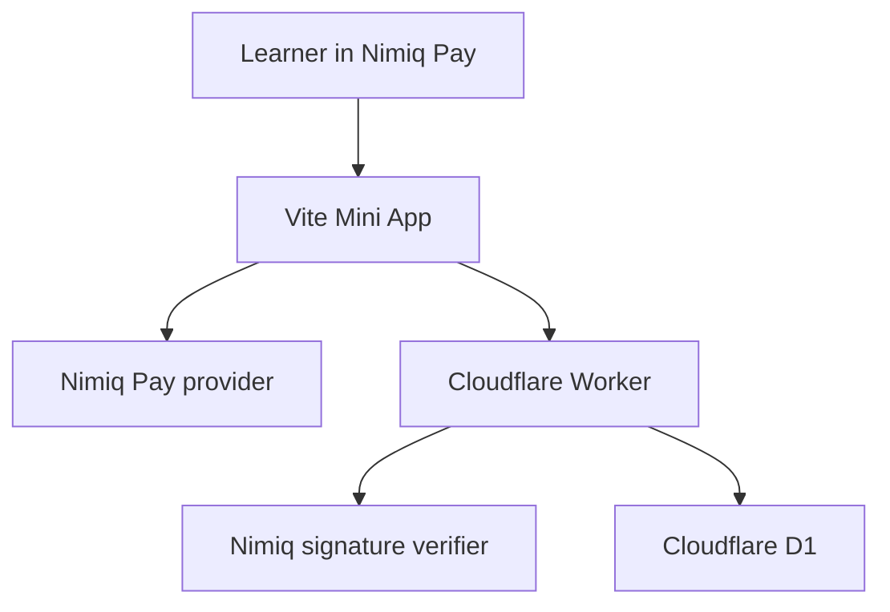

# NimQuest

NimQuest is a learn-by-doing Nimiq Mini App. A learner completes a short, sourced quest, passes a server-graded quiz, and signs a one-time message in Nimiq Pay. NimQuest verifies the signature and creates a wallet-backed completion record without sending NIM.

[Open the live Mini App](https://nimquest.artistic-chip.workers.dev)

[Read the in-app documentation](https://nimquest.artistic-chip.workers.dev/docs)

## Judge Path

1. Open NimQuest inside Nimiq Pay.
2. Start **Meet Nimiq**.
3. Read the lesson and answer three questions.
4. Correct any marked answer.
5. Select **Verify with Nimiq Pay**.
6. Approve account access.
7. Read and sign the one-time completion message.
8. Open **My Journey** and **Leaderboard**.

Expected result: the quest shows as verified, the Journey count increases, and the masked wallet label joins the mandatory public leaderboard. No NIM moves.

## Live Features

- 20 sourced quests across seven Nimiq learning paths
- Server-side grading with answer keys excluded from browser bundles
- Five-minute signing challenges with nonce expiry and replay protection
- Nimiq signed-message verification and signer-address derivation
- Cloudflare D1 persistence for verified completions
- Journey recovery after approved Nimiq Pay account access
- Eight badges backed by verified completion records
- Opaque public receipt IDs and masked wallet labels
- Mandatory wallet leaderboard ranked by verified quest count
- Feedback writes protected by a completion-only token
- Privacy Notice, Terms of Use, offline recovery, and 404 states
- In-app architecture, integration, security, and local setup guides
- Rewards shown as **Coming soon**, with no current payout promise

## Nimiq Pay Integration

NimQuest uses the Nimiq Pay Mini Apps Framework for:

- `listAccounts()` to request the selected public Nimiq account
- `isConsensusEstablished()` and `getBlockNumber()` to confirm wallet readiness
- `sign()` to approve a one-time quest-completion message

Nimiq Pay keeps private keys inside the wallet. NimQuest receives the public account, public key, and signature only after user approval. NimQuest does not request a device identifier.

## Architecture



The browser receives lessons, options, and explanations. Correct answer indexes remain in the server source. The Worker grades answers, verifies signatures, consumes challenges, and stores verified completions.

## API

```text
GET  /health
GET  /api/quests
GET  /api/quests/:id
GET  /api/leaderboard
GET  /api/completions?wallet=:address
GET  /api/completions/:receiptId
POST /api/grade
POST /api/completion-challenges
POST /api/complete
POST /api/feedback
```

Write routes reject unsupported browser origins. D1 rate counters limit grading, challenge, completion, and feedback requests. Each wallet can hold no more than five active signing challenges.

## Local Setup

Prerequisites:

- Node.js 20 or later
- npm

Install and test:

```bash
npm ci
npm test
npm run build:web
npm start
```

Open `http://localhost:8787`.

Run browser smoke tests:

```bash
npx playwright install chromium
npm run test:browser
```

Run the Worker locally:

```bash
npx wrangler d1 migrations apply nimquest --local
npm run dev:worker
```

Run the full release check:

```bash
npm run qa
```

## Production Migration

Before deployment, apply all D1 migrations:

```bash
npx wrangler d1 migrations apply nimquest --remote
```

Migration `0003_privacy_and_abuse_controls.sql` adds opaque receipt IDs, feedback authorization hashes, abuse counters, and removal markers for legacy device identifiers.

## Security and Privacy

- Private keys and recovery data never enter NimQuest.
- Public APIs mask wallet labels.
- Public receipts use opaque IDs.
- Public keys, signatures, quiz answers, feedback tokens, and device identifiers are not public.
- Every verified completion joins the public leaderboard. There is no ranking opt-out.
- Write-route rate counters store a short-lived SHA-256 digest, not a raw IP address.

Read the [Privacy Notice](https://nimquest.artistic-chip.workers.dev/privacy), [Terms of Use](https://nimquest.artistic-chip.workers.dev/terms), and [security guide](https://nimquest.artistic-chip.workers.dev/docs/security).

## Verification Evidence

- 25 Node, API, and cryptography tests pass.
- 56 rendered-route checks pass across 320, 375, 390, and 430 CSS-pixel widths.
- The production build passes.
- The Worker dry run passes.
- The local Worker and D1 integration passes a real Nimiq-format signature, persistence, recovery, receipt, feedback authorization, leaderboard, and replay-rejection flow.
- A native Nimiq Pay proof has been completed successfully on iPhone in the current production release.

## Documentation

- [In-app documentation](https://nimquest.artistic-chip.workers.dev/docs)
- [Product requirements](PRD.md)
- [Architecture](ARCHITECTURE.md)
- [Nimiq Pay integration](INTEGRATION.md)
- [Security](docs/SECURITY.md)
- [Contributing](CONTRIBUTING.md)

## Current Limits

- Quest rewards are coming soon. No reward asset is funded or distributed.
- Verified completions are stored in Cloudflare D1, not written to the Nimiq blockchain.
- The public leaderboard is mandatory after wallet verification.
- The current starter catalog is maintained in the repository. There is no quest-authoring interface.

## License

MIT
